# HideAndSeek (Forensics)

  
  

## Flag

``
HTB{g0oD_hUnt1n_y0u_f0und_1t!}
``

## Solution

We're given a linux machine with credentials for user and we can get root with sudo. In root home directory there is a solveme executable which checks if we remediated the issues and if all are remediated then we get the flag

So we start searching the machine firstly at the users it has. In /etc/passwd there is user hodor where he has an id 0, where he has root privileges so we have to delete him from passwd and shadow files.

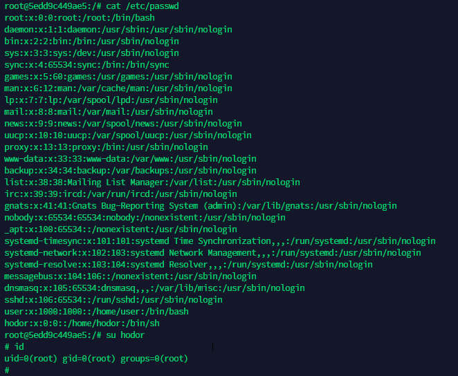

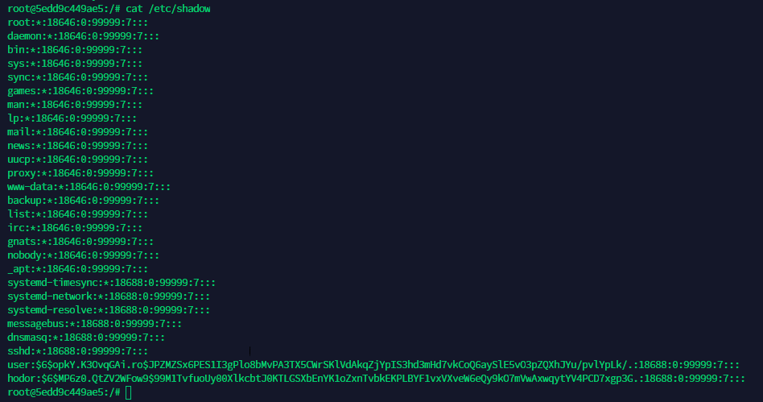

Now the issue 2 is fully remediated.

Looking at the authorized_keys at root home directory we see a strange ssh key for a bd user. So we remove it.

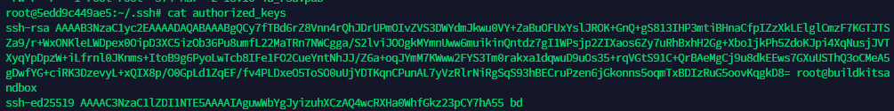

Also we found at /etc/rc2.d/S01ssh symlink of /etc/init.d/ssh which starts/stop the ssh daemon, it's executed at runlevel 2 (i.e every time ssh daemon starts/stop or the machine boot up, more about runlevels [here](https://en.wikipedia.org/wiki/Runlevel)). Inside the S01ssh the attacker insert his ssh key in root authorized_keys, so we remove the command.

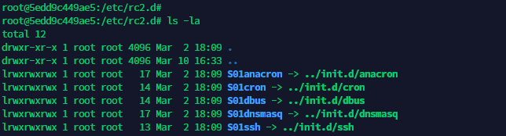
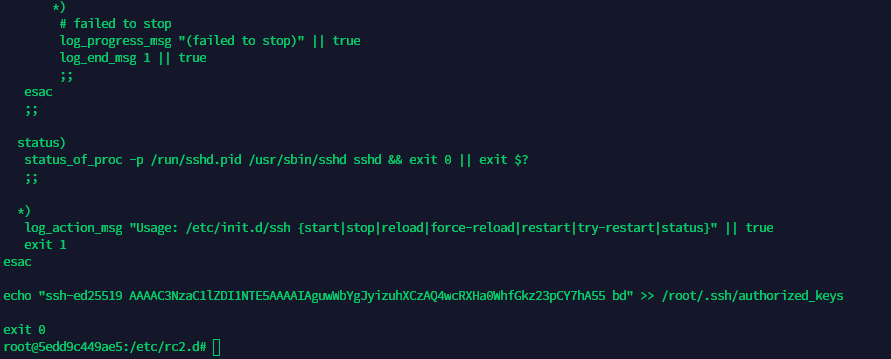

Now issue 4 is fully remediated.

Looking for unusual cron jobs we find at /etc/cron.daily an unsual access-up script which creates some weird binaries at /sbin/ folder.

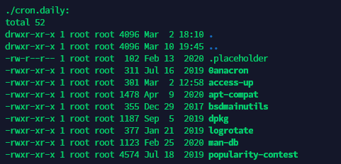
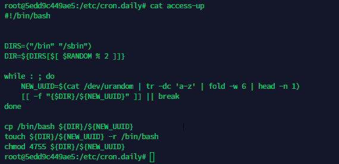

We delete the access-up script. Then we delete the weird named binaries in /sbin folder.

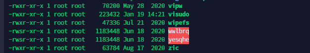
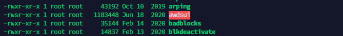

Now the issue 3 is fully remediated.

Finally looking the .bashrc file of user at /home/user/ and at aliases we see the cat has an alias that executing a bash command and the actual cat command.

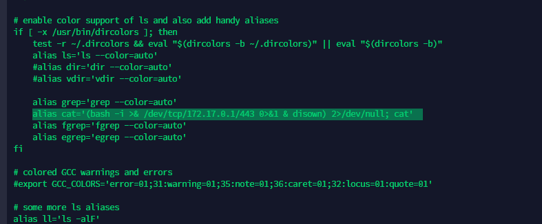

And now issue 1 is fully remediated. So running the solveme executable we get flag

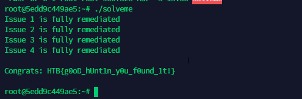