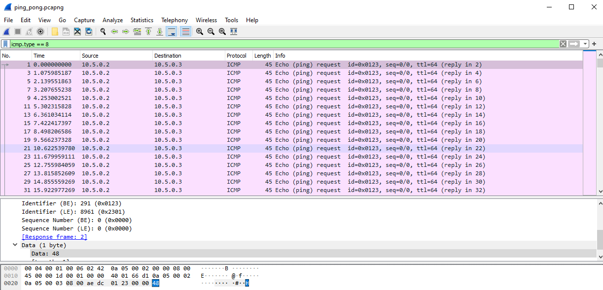
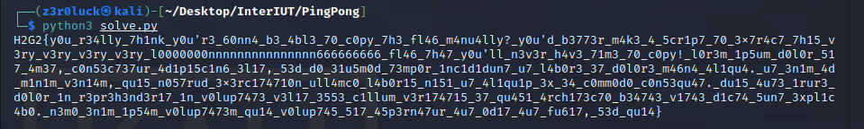

# InterIUT CTF - Ping! Pong? Writeup (Forensics)

### Description
#### knock knock knock.

The challenge provides us with a pcap file which only have icmp traffic (ping requests replies) which they dont have something interesting. But if we look closely the packets we see the last byte in packets changing in each request and each reply. The first is H, next 2, next G and so on, so probably it's the flag we want.


So scapy comes to help. We create a python script to extract the icmp requests packets and keep the payload only. Also keep only the byte we need which is the flag.



```python
from scapy.all import *
packets = rdpcap('ping_pong.pcapng')
for p in packets:
	if p['ICMP'].type == 8:
		data = str(p['ICMP'].load)
		new = data[2:3]
```


It's the start of the flag. We pass the data to a flag variable to get it together and finally print the flag!

```python
from scapy.all import *
packets = rdpcap('ping_pong.
flag = ""
for p in packets:
	if p['ICMP'].type == 8:
		data = str(p['ICMP'].load)
		new = data[2:3]
		flag += new
print(flag)
```

