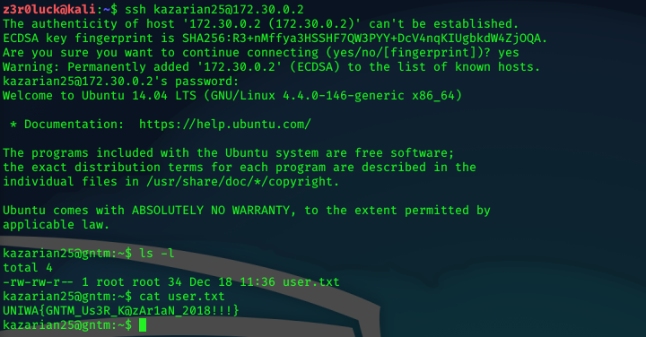

# GNTM - Full Pwn

## User - The Website

GNTM is a full pwn machine made from bertolis for UNIWA CTF. Starting with nmap we got 2 ports open.

Fuzzing for directories in http port we get a /fashion.

Visiting the /fashion we see that the website is running in Drupal8.

Searching for exploits this version of Drupal is vulnerable to Drupalgeddon2. We can use the metasploit module to try to get reverse shell.

We have a reverse shell as www-data. Enumareting further from here for privilege escalation we get credentials for mysql database.

We can connect to mysql with admin:mitroglou creds. We find a user's table with a username kazarian25 and the hash. Cracking the hash with hashcat we get password emmawatson.

We can connect with ssh as kazarian25 in the machine and user.txt flag.

## Root - BeOnRoot

Enumareting for binaries we get a `check` binary in `/usr/local/bin`.

Reversing the binary, we see that it runs a `tail` command opening list.txt file in `/root`. So, creating a fake `tail` binary that it just opens an shell and pointing the directory we created it, `/tmp` we run check and get shell as root.
